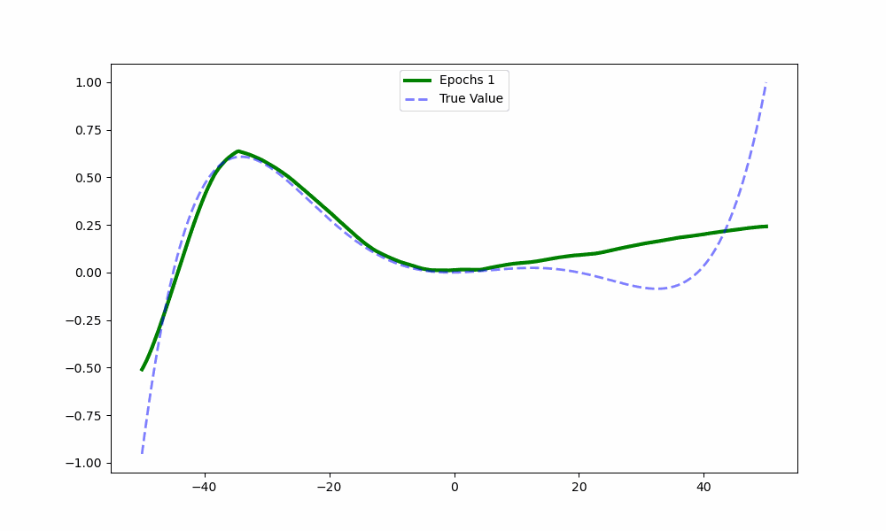
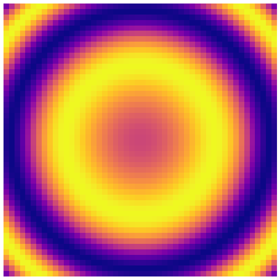
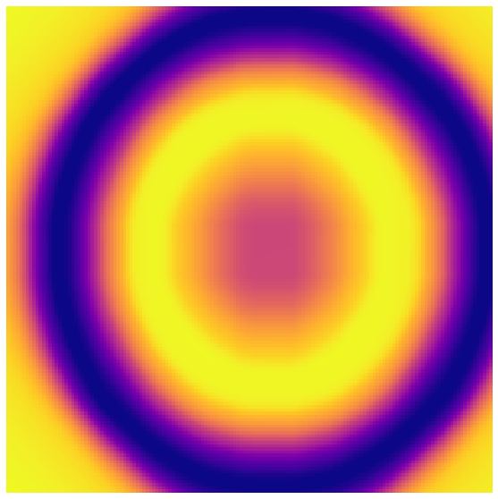
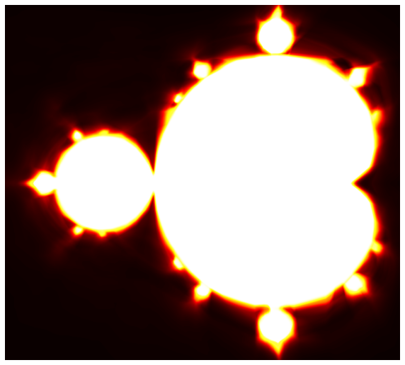

# Machine-Learning-with-functions
This project uses Tensorflow's high level API Keras to train neural networks in Python.
The goal of this project was to explore the nature of neural networks as universal function fitting algorithms by training networks to recognise different kinds of functions. 
This could then be tested by asking the network to interpolate or extrapolate the data, testing the algorithms understanding of the dataset and the "rule" or function underpinning it
In one dimension, I created an animation of the network learning to fit a target function over a number of training epochs:

Next, I moved to two dimensions, using the x and y coordinates as inputs, with a one dimensional output represented as a colour, with these relationships again defined by a mathematical function.
Here, the network learns the function using the training data in this image:

Then the neural network is tasked with producing a higher resolution version of the image, using a more dense set of x,y input coordinates:

Finally, I tried this same method on the Mandelbrot set. I first created a gif zooming in on the Mandelbrot set, to demonstrate its endless complexity:

As this is a fractal, it is significantly harder for a neural network to learn its structure.
As it has an infinite length boundary, this leads to high rates of variation between pixels, which is hard for the network to capture as high frequency detail tends to be harder for the network to learn.
After optimising the training and dedicating as much computing time as I had the patience for, here is the result:

